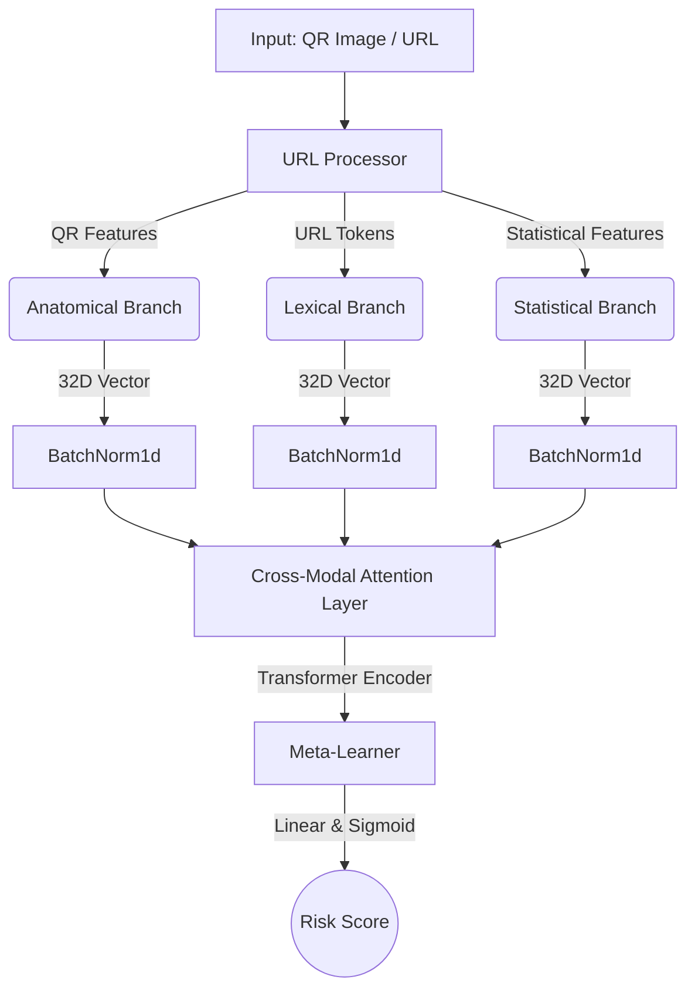

# PhishFusion

PhishFusion is a deep learning-based phishing and quishing (QR phishing) detection system. It utilizes a multi-branch architecture to extract and analyze distinct feature sets from URLs and QR codes, fusing them through a cross-modal attention mechanism to predict malicious intent.

## System Architecture

The application is structured into three primary components:

1. **Model Architecture**: A PyTorch-based multimodal neural network.
2. **Backend**: A FastAPI service that serves the model and processes incoming URL or QR image requests.
3. **Frontend**: A React application built with Vite and Capacitor for cross-platform support.

### Model Schema

The core classification model (`PhishFusion`) employs three specialized expert branches, normalizes their embeddings, and fuses them using a Transformer-based attention mechanism.



## Directory Structure

* `app/frontend/`: React and Vite-based user interface. Includes Capacitor configuration for mobile deployment.
* `app/backend/`: FastAPI server providing the `/predict` endpoint for the model.
* `models/`: PyTorch neural network definitions.
    * `meta_learner.py`: The main PhishFusion model.
    * `anatomical.py`, `lexical.py`, `statistical.py`: Expert branch architectures.
* `utils/`: Data processing utilities (e.g., `url_processor.py`, `metrics.py`).
* `data/`: Processed datasets for training and testing.
* `weights/`: Trained model parameters (`.pth`) and statistical scalers (`.pkl`).
* `train.py`: Script for training the PhishFusion model.
* `eval_branches.py`: Evaluation script for individual model branches.

## Setup and Installation

### Prerequisites

* Python 3.9+
* Node.js and npm
* PyTorch (CUDA supported for GPU acceleration)

### Backend

1. Navigate to the root directory.
2. Install Python dependencies:
   ```bash
   pip install -r app/backend/requirements.txt
   ```
3. Run the FastAPI server:
   ```bash
   uvicorn app.backend.main:app --host 0.0.0.0 --port 8000
   ```

### Frontend

1. Navigate to the frontend directory:
   ```bash
   cd app/frontend
   ```
2. Install Node dependencies:
   ```bash
   npm install
   ```
3. Start the development server:
   ```bash
   npm run dev
   ```

## Usage

### Training

To train the model on your dataset, ensure your processed CSV files are in the `data/processed/` directory and execute the training script from the root directory:

```bash
python train.py
```

### API Inference

The backend exposes a `/predict` endpoint that accepts a URL string or a QR code image upload. It returns a JSON response containing the calculated `risk_score` and a boolean `is_phishing` flag.

```json
{
  "risk_score": 0.87,
  "is_phishing": true,
  "decoded_url": "http://example-phishing-site.com"
}
```
